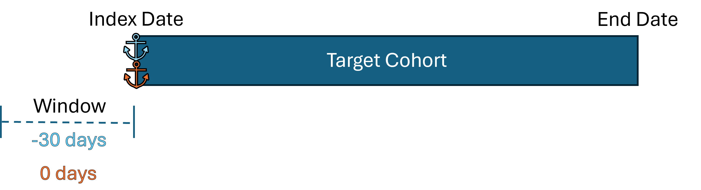

```{r setup, include=FALSE}
knitr::opts_chunk$set(echo = TRUE)

withr::local_envvar(
  R_USER_CACHE_DIR = tempfile(),
  EUNOMIA_DATA_FOLDER = Sys.getenv("EUNOMIA_DATA_FOLDER", unset = tempfile())
)
```

## Anchoring
The `computePathways()` function has two 'anchor' arguments, `startAnchor` and `endAnchor`. These arguments dictate what point to use as a reference. The two values that you can set for both of these parameters are: `"startDate"` and `"endDate"`, referencing the `cohort_start_date` and `cohort_end_date` columns in the cohort table. By default they are set to: `startAnchor = "startDate"` and `endAnchor = "endDate"`

## windowStart and windowEnd
The `windowStart` and `windowEnd` parameters dictate an offset from their corresponding *anchor*. If we assuming the following parameters (defaults):

```
startAnchor = "startDate"
windowStart = 0
endAnchor = "endDate"
windowEnd = 0
```

We will just use the `cohort_start_date` and `cohort_end_date` as our window of interest.

```{r, eval=FALSE}
outputEnv <- computePathways(
  cohorts = cohorts,
  cohortTableName = "cohort_table",
  cdm = cdm,
  startAnchor = "startDate",
  windowStart = 0,
  endAnchor = "endDate",
  windowEnd = 0
)
```


We can extend our window with a 30 days on either side by altering the `windowStart` and `windowEnd` variables:

```
startAnchor = "startDate"
windowStart = -30
endAnchor = "endDate"
windowEnd = 30
```

Note that `windowStart = -30`, as in we subtract 30 days from the `startAnchor`. `windowEnd = 30` as in we add 30 days to the `endAnchor`.

```{r, eval=FALSE}
outputEnv <- computePathways(
  cohorts = cohorts,
  cohortTableName = "cohort_table",
  cdm = cdm,
  startAnchor = "startDate",
  windowStart = -30,
  endAnchor = "endDate",
  windowEnd = 30
)
```


## Changing the anchoring
We can change the anchoring of `startAnchor` and `endAnchor` to set our window to a period prior to the index date:

```
startAnchor = "startDate"
windowStart = -30
endAnchor = "startDate"
windowEnd = 0
```

Note that we set **both** the `startAnchor` and `endAnchor` are set to `"startDate"`. So we start -30 days from the index date, and end on the index date.

```{r, eval=FALSE}
outputEnv <- computePathways(
  cohorts = cohorts,
  cohortTableName = "cohort_table",
  cdm = cdm,
  startAnchor = "startDate",
  windowStart = -30,
  endAnchor = "startDate",
  windowEnd = 0
)
```


